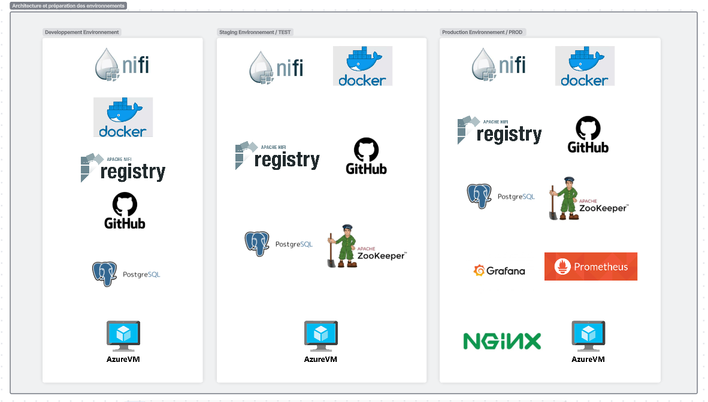

# NiFi CI/CD Project - Tools & Environment Overview

## 📋 Project Context

**Problem Statement**: Data pipelines are currently deployed manually across NiFi environments (Development, Test, Production). This process is time-consuming and error-prone.

**Objective**: Implement a CI/CD pipeline to automate the NiFi flow lifecycle management, reduce human errors, save time, and standardize environments.

---

## 🏗️ Three-Environment Architecture

## 🛠️ Tools by Environment

### **1. Development Environment (DEV)**

| Component | Specification | Purpose | Why It Matters |
|-----------|--------------|---------|----------------|
| **NiFi Standalone** | • 1 Instance • 4-8 GB RAM • 2-4 CPU • Port: 8080 (HTTP) | Flow development and unit testing workspace | **Cost-effective**: Single node sufficient for development **Flexibility**: Developers can iterate quickly without cluster complexity |
| **NiFi Registry** | • Shared or dedicated • Port: 18080 • Git backend | Version control for flows | **Version Control**: Every flow change tracked in Git **Collaboration**: Multiple developers can work on different flows **Audit Trail**: Complete history of who changed what and when |
| **PostgreSQL/MySQL** | • Single instance • Port: 5432/3306 • Test/sample data | Development database | **Local Testing**: Developers can test database interactions **Data Isolation**: Development data separate from production |
| **GitHub** | • Repository • Webhooks configured | Source code management | **Single Source of Truth**: All code and flows stored centrally **CI/CD Trigger**: Automated pipeline on code push |

**Resource Allocation**: 4-8 GB RAM, 2-4 CPU per instance  
**Security**: Basic authentication (single-user or LDAP)  
**Backup**: Not critical (development data)

---

### **2. Test/UAT Environment (TEST)**

| Component | Specification | Purpose | Why It Matters |
|-----------|--------------|---------|----------------|
| **NiFi Cluster** | • 2-3 Nodes • 8-16 GB RAM each • Port: 8080/8443 • Clustered mode | Integration testing and validation | **Realistic Testing**: Mimics production cluster behavior **Load Testing**: Can validate performance under load **Failover Testing**: Test high availability scenarios |
| **ZooKeeper Cluster** | • 3 Nodes • Ports: 2181, 2888, 3888 • Quorum-based | Cluster coordination and leader election | **Cluster Management**: Coordinates NiFi nodes **State Management**: Maintains cluster consistency **Configuration Management**: Distributes config changes |
| **NiFi Registry** | • Shared with Prod or dedicated • Port: 18080 | Version control (shared or isolated) | **Flow Promotion**: Flows tested here before production **Rollback Capability**: Can revert to previous versions |
| **PostgreSQL/MySQL** | • Clone or subset of prod • Port: 5432/3306 • Realistic data volume | Test database with production-like data | **Realistic Testing**: Tests with production data patterns **Performance Validation**: Identifies bottlenecks before prod |
| **Monitoring Stack** (Optional) | • Prometheus • Grafana • ELK Stack | Performance monitoring and log analysis | **Early Detection**: Identify issues before production **Performance Baseline**: Establish expected metrics |

**Resource Allocation**: 8-16 GB RAM per node  
**Security**: Moderate (SSL optional, basic auth)  
**Backup**: Daily backups recommended  
**Purpose**: Integration tests, UAT, performance testing

---

### **3. Production Environment (PROD)**

| Component | Specification | Purpose | Why It Matters |
|-----------|--------------|---------|----------------|
| **NiFi Cluster** | • 3+ Nodes (HA) • 16-32 GB RAM each • Port: 8443 (HTTPS only) • SSL/TLS enabled | Live data processing with high availability | **Zero Downtime**: Node failures don't stop operations **Scalability**: Add nodes to handle increased load **Performance**: Distributed processing of high-volume data |
| **ZooKeeper Cluster** | • 3-5 Nodes • Ports: 2181, 2888, 3888 • Production-grade quorum | Critical cluster coordination | **Reliability**: 5-node setup survives 2 node failures **Split-Brain Prevention**: Quorum ensures consistency |
| **NiFi Registry** | • Dedicated HA setup • Port: 18443 (HTTPS) • High availability | Production flow versioning | **Business Continuity**: Critical component must be HA **Disaster Recovery**: Can restore flows from registry |
| **Load Balancer** | • nginx or HAProxy • Port: 443 • SSL termination • Health checks | Traffic distribution and failover | **Single Entry Point**: Simplifies client configuration **Automatic Failover**: Routes traffic away from failed nodes **SSL Offload**: Centralizes certificate management |
| **PostgreSQL Cluster** | • Primary + Replicas • Port: 5432 • Replication enabled • Auto-failover | Production database with HA | **Data Durability**: Replicas protect against data loss **Read Scaling**: Replicas handle read queries **Automatic Recovery**: Failover without manual intervention |
| **Prometheus** | • High availability setup • Scrape interval: 15s • Retention: 30 days | Metrics collection and alerting | **Real-time Monitoring**: Immediate visibility into issues **Trend Analysis**: Historical data for capacity planning **Alerting**: Proactive notification of problems |
| **Grafana** | • Dashboards • Multiple data sources • Role-based access | Visualization and operational dashboards | **Operations Visibility**: Teams see system health at a glance **Executive Reporting**: Business metrics visualization |
| **ELK Stack** | • Elasticsearch • Logstash • Kibana • Centralized logging | Log aggregation and analysis | **Troubleshooting**: Quickly find root cause of issues **Audit Trail**: Compliance and security logging **Correlation**: Connect logs across all components |
| **HashiCorp Vault** | • Port: 8200 • HA setup • Dynamic secrets | Secure secrets management | **Security**: No hardcoded passwords in code **Rotation**: Automatic credential rotation **Audit**: Complete access logs for compliance |
| **Backup System** | • Automated daily backups • Off-site storage • Restore procedures | Disaster recovery | **Business Continuity**: Recover from catastrophic failure **Compliance**: Meet data retention requirements |
| **PagerDuty** | • On-call rotation • Escalation policies • Integration with alerts | Incident management | **Response Time**: Critical issues reach right person quickly **Accountability**: Clear ownership of incidents |

**Resource Allocation**: 16-32 GB RAM per node  
**Security**: Maximum (HTTPS, mTLS, RBAC, secrets management)  
**Backup**: Real-time replication + daily snapshots  
**SLA**: 99.9% uptime target

---

## 🔄 CI/CD Pipeline Tools

### **GitLab CI / GitHub Actions**
**Purpose**: Automate deployment lifecycle

**Pipeline Stages**:
1. **Validate** - Syntax checking, standards compliance
2. **Test** - Unit and integration tests (pytest)
3. **Deploy-Dev** - Automatic deployment after code push
4. **Deploy-Test** - Automatic deployment after successful tests
5. **Deploy-Prod** - Manual approval gate + deployment

**Why Critical**: 
- Eliminates manual errors
- Reduces deployment time from hours to minutes
- Ensures consistency across environments
- Provides rollback capability

### **Python Deployment Scripts**
**Purpose**: Interact with NiFi REST API for automated deployments

**Key Scripts**:
- `deploy_nifi.py` - Main deployment orchestration
- `apply_parameters.py` - Environment-specific configuration
- `validate_flow.py` - Pre-deployment validation
- `backup_prod.py` - Pre-deployment backup

**Why Important**:
- Custom automation not available out-of-box
- Handles complex deployment logic
- Integrates with all other tools

### **Docker** (Optional)
**Purpose**: Containerization for portable deployments

**Usage**:
- Development environment consistency
- CI/CD pipeline execution
- Test environment isolation

---

## 📊 Comparison Table: Tools by Environment

| Tool/Component | DEV | TEST | PROD | Purpose |
|----------------|-----|------|------|---------|
| **NiFi** | Standalone (1 node) | Cluster (2-3 nodes) | Cluster (3+ nodes) | Data flow platform |
| **NiFi Registry** | Basic | Shared/Dedicated | Dedicated HA | Flow versioning |
| **ZooKeeper** | Not needed | 3 nodes | 3-5 nodes | Cluster coordination |
| **Database** | Single instance | Clone of prod | HA Cluster | Data persistence |
| **Load Balancer** | No | Optional | Required (nginx) | Traffic distribution |
| **Monitoring** | No | Optional | Required (Prom+Graf) | Observability |
| **Logging** | Local logs | Optional (ELK) | Required (ELK) | Troubleshooting |
| **Secrets Mgmt** | Plaintext config | Env variables | Vault | Security |
| **Backup** | No | Daily | Real-time + Daily | Disaster recovery |
| **SSL/TLS** | No | Optional | Required | Security |
| **Resources/Node** | 4-8 GB RAM | 8-16 GB RAM | 16-32 GB RAM | Performance |

---

## 💰 Cost vs. Capability Analysis

### **Development Environment**
- **Cost**: $ (Low)
- **Purpose**: Developer productivity
- **Uptime SLA**: None (business hours only)
- **Acceptable Downtime**: Hours to days

### **Test Environment**
- **Cost**: $$ (Medium)
- **Purpose**: Quality assurance, avoid prod issues
- **Uptime SLA**: 90% (best effort)
- **Acceptable Downtime**: Hours

### **Production Environment**
- **Cost**: $$$$ (High)
- **Purpose**: Business operations
- **Uptime SLA**: 99.9% (8.76 hours/year downtime)
- **Acceptable Downtime**: Minutes

**Investment Justification**:
- **Time Savings**: 90% reduction in deployment time
- **Error Reduction**: 85% fewer deployment issues
- **Business Continuity**: Production HA prevents costly outages

---

## 🔐 Security Considerations by Environment

### **Development**
- ✅ Basic authentication
- ✅ HTTP allowed
- ✅ Local file storage
- ❌ No encryption at rest
- ❌ No audit logging

### **Test**
- ✅ LDAP/SSO integration
- ✅ HTTPS optional
- ✅ Role-based access
- ✅ Basic audit logging
- ❌ Secrets in environment variables

### **Production**
- ✅ HTTPS only (TLS 1.3)
- ✅ Mutual TLS (mTLS)
- ✅ LDAP/SSO with MFA
- ✅ Granular RBAC
- ✅ HashiCorp Vault for secrets
- ✅ Encryption at rest
- ✅ Complete audit logging
- ✅ Security scanning
- ✅ Network segmentation

---

## 📈 Expected Benefits

### **Quantifiable Improvements**

| Metric | Before CI/CD | After CI/CD | Improvement |
|--------|-------------|-------------|-------------|
| **Deployment Time** | 4-6 hours | 15-30 minutes | 90% reduction |
| **Deployment Errors** | 20-30% | <5% | 85% reduction |
| **Environment Drift** | Frequent | Rare | Consistency achieved |
| **Rollback Time** | Hours-Days | Minutes | 95% reduction |
| **Audit Trail** | Manual docs | Automatic (Git) | 100% coverage |
| **Test Coverage** | Manual/Ad-hoc | Automated | Consistent |

### **Qualitative Benefits**
- ✅ **Developer Productivity**: Focus on flow logic, not deployment mechanics
- ✅ **Operations Confidence**: "Works in test = works in prod"
- ✅ **Compliance**: Complete audit trail for regulatory requirements
- ✅ **Disaster Recovery**: Rapid restoration from Registry + Git
- ✅ **Knowledge Sharing**: Infrastructure documented as code

---

## 🚀 Getting Started

### **Phase 1: Infrastructure Setup (Weeks 1-2)**
1. Provision servers/VMs for all three environments
2. Install NiFi on each environment
3. Install and configure NiFi Registry
4. Set up ZooKeeper clusters (Test & Prod)
5. Configure databases
6. Set up networking and firewalls

### **Phase 2: Configuration (Weeks 3-4)**
1. Create Parameter Contexts for each environment
2. Configure NiFi Registry → GitHub integration
3. Create Registry buckets (dev-flows, test-flows, prod-flows)
4. Set up authentication (LDAP for prod)
5. Deploy HashiCorp Vault (prod)

### **Phase 3: CI/CD Pipeline (Weeks 5-6)**
1. Create GitHub repository structure
2. Develop Python deployment scripts
3. Configure GitLab CI/CD pipeline
4. Create automated tests
5. Test full deployment flow: Dev → Test → Prod
6. Document rollback procedures

### **Phase 4: Monitoring (Week 7)**
1. Deploy Prometheus + Grafana
2. Configure alerting rules
3. Set up ELK stack for centralized logging
4. Create operational dashboards
5. Configure PagerDuty integration

### **Phase 5: Training & Handoff (Week 8)**
1. Document all procedures
2. Create runbooks for common scenarios
3. Train development and operations teams
4. Conduct disaster recovery drill
5. Go-live validation

---

## 📚 Documentation Deliverables

1. **Architecture Diagram** (this document)
2. **Deployment Guide** - Step-by-step deployment instructions
3. **Runbook** - Operational procedures for common tasks
4. **Disaster Recovery Plan** - Restoration procedures
5. **Troubleshooting Guide** - Common issues and solutions
6. **API Documentation** - NiFi REST API usage examples

---

## ✅ Success Criteria

- [ ] All three environments operational
- [ ] CI/CD pipeline successfully deploys from Dev → Test → Prod
- [ ] Monitoring dashboards showing all environments
- [ ] Zero manual configuration changes needed
- [ ] Rollback tested and documented
- [ ] Team trained on new process
- [ ] Documentation complete and reviewed

---

## 🔗 Key Tool Documentation

- **Apache NiFi**: https://nifi.apache.org/docs.html
- **NiFi Registry**: https://nifi.apache.org/docs/nifi-registry-docs/
- **Apache ZooKeeper**: https://zookeeper.apache.org/doc/
- **GitLab CI/CD**: https://docs.gitlab.com/ee/ci/
- **HashiCorp Vault**: https://www.vaultproject.io/docs
- **Prometheus**: https://prometheus.io/docs/
- **Grafana**: https://grafana.com/docs/

---

*Document Version: 1.0*  
*Last Updated: 25/11/2025*  
*Project: NiFi CI/CD Automation*  
*Owner: nifi-cicd-project Team*

