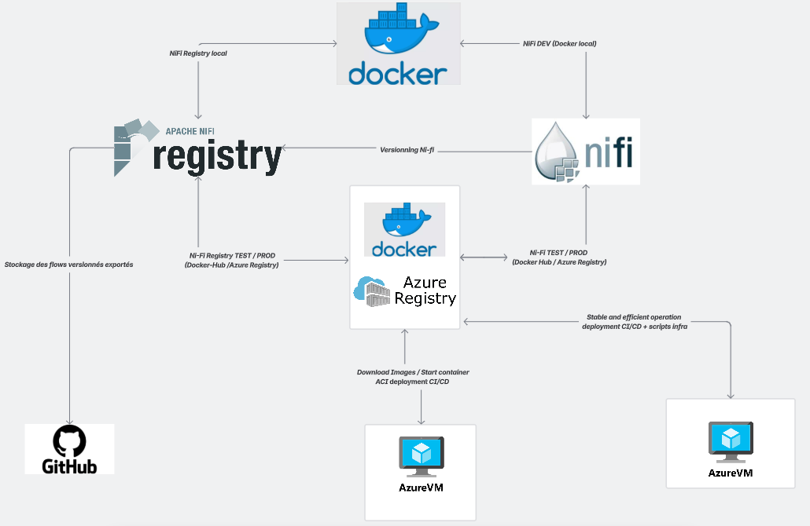

# System Environments & Tools Overview

This document provides a clear, professional overview of the environments, tools, and technologies used across the project lifecycle.  
It also includes the architecture diagram illustrating how development, CI/CD, and deployment interact.

---

## 1. Environments Overview

The project uses three main environments:

### **1. Development Environment**
- Used by developers to build, update, and test features locally.
- Components:
  - Developer machine (Windows, Linux, or macOS)
  - Local Docker containers (NiFi, NiFi Registry, PostgreSQL)
  - Local code editor (VS Code / IntelliJ)
  - Git for version control

---

### **2. Integration / Test Environment**
- Managed through CI/CD.
- Used to automatically execute:
  - Build validation
  - Code quality checks
  - Unit and integration tests
  - Deployment of NiFi flows to a test NiFi instance

Tools involved:
- GitHub Actions (CI)
- GitHub Container Registry
- NiFi Registry (Test)
- Azure resource group (Test)

---

### **3. Production Environment**
- Final operational environment.
- Ensures high availability, security, and performance.

Components:
- Azure Virtual Machine (for NiFi)
- Azure Container Registry
- Azure Container Instances (optional deployment model)
- Locked-down NiFi Registry (restricted access)
- Logging, monitoring, alerts

---

## 2. Tools Used

| Tool / Service | Purpose |
|----------------|---------|
| **GitHub** | Repository hosting, issue management, CI/CD |
| **GitHub Actions** | Pipeline automation (build, test, deploy) |
| **Docker** | Containerization of NiFi and NiFi Registry |
| **Azure VM** | Hosting NiFi in production |
| **Azure Container Registry (ACR)** | Stores Docker images |
| **Azure Container Instances (ACI)** | Optional lightweight deployment without VM |
| **NiFi Registry** | Versioning of dataflows |
| **NiFi** | Data pipeline orchestration |
| **PostgreSQL** | Metadata & flow storage |
| **Markdown + GitHub Pages (optional)** | Project documentation |

---

## 3. Architecture Diagram

Below is the architecture diagram representing the global flow between Development, CI/CD, and Production.

> ⚠️ Make sure the file below is committed to your repository in the following path:  
> `docs/assets/environnement_diagram.png`

